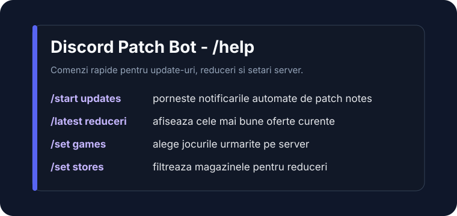
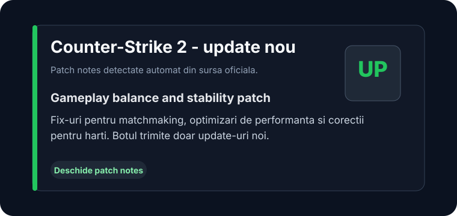

# Discord Patch Bot

[](https://github.com/CiobotaruAndrei/discord-patch-bot/actions/workflows/ci.yml)
[](https://github.com/CiobotaruAndrei/discord-patch-bot/actions/workflows/dependency-audit.yml)
[](https://github.com/CiobotaruAndrei/discord-patch-bot/actions/workflows/codeql.yml)
[](https://github.com/CiobotaruAndrei/discord-patch-bot/actions/workflows/release.yml)

[](LICENSE)

Discord Patch Bot trimite automat pe servere Discord notificari despre patch notes, update-uri de jocuri, reduceri Steam/Epic, preturi Steam, DLC-uri, status servere si health/metrics.

Repo-ul este organizat in jurul sursei din `src/`, cu TypeScript strict si un mic modul Rust/N-API pentru algoritmi puri de fuzzy matching, normalizare si hashing.

## Cerinte

- Node.js 20 sau mai nou
- npm 10 sau mai nou
- Rust stable si toolchain Cargo, necesare pentru addon-ul N-API
- MongoDB 6/7 sau un MongoDB Atlas compatibil
- Un Discord bot token si application/client ID din Discord Developer Portal

## Setup local

```bash
cd src
npm ci
cp .env.example .env
```

Completeaza in `src/.env` cel putin:

```bash
MONGO_URI=mongodb://localhost:27017/discord-patch-bot
DISCORD_TOKEN=...
DISCORD_CLIENT_ID=...
METRICS_PUBLIC=true
```

`src/.env.example` documenteaza si variabilele optionale importante: metrics token, reverse proxy, admin webhook, proxy URL templates, limite de scraping, cooldown-uri Discord, circuit breaker, pending queues, cache-uri, Mongo pool si rate limit pentru endpoint-urile HTTP.

Porneste MongoDB local sau foloseste Docker Compose din radacina repo-ului.

## Comenzi utile

Din `src/`:

```bash
npm run build       # compileaza Rust/N-API si TypeScript
npm start           # porneste codul deja compilat din dist/app/main.js
npm run dev         # build + start pentru dezvoltare locala
npm run check       # typecheck, build, syntax/config/dependency check si teste
npm run test        # build + testele Node
npm run lint        # typecheck normal + strict
npm run audit       # audit pe dependintele runtime
```

`npm start` nu mai ruleaza build automat. In productie, build-ul trebuie facut in CI sau in imaginea Docker, iar runtime-ul doar porneste `dist/app/main.js`.

## Docker Compose

Din radacina repo-ului:

```bash
cp src/.env.example src/.env
# editeaza DISCORD_TOKEN si DISCORD_CLIENT_ID

docker compose up --build
```

Compose porneste botul si MongoDB intr-o retea interna Docker. Mongo nu este publicat pe host; botul publica HTTP doar pe `127.0.0.1:3000`, ca endpoint-urile locale sa nu fie expuse accidental in retea.

Daca ai nevoie temporar sa accesezi Mongo din host, foloseste un override local necomis si leaga portul doar pe loopback, de exemplu `127.0.0.1:27017:27017`. Pentru productie seteaza un `METRICS_TOKEN` real si evita expunerea publica a `/metrics`.

## Dependinte si audit

Dependintele sunt blocate prin `src/package-lock.json`, iar CI instaleaza cu `npm ci`.

- `npm run audit` ruleaza local auditul pe dependintele runtime.
- `npm run check:dependencies` verifica local ca dependintele runtime si build/dev directe sunt pin-uite exact, ca intrarile directe din lockfile rezolva la aceleasi versiuni si ca URL-urile din lockfile folosesc registry npm peste HTTPS.
- `.github/workflows/dependency-audit.yml` ruleaza saptamanal acelasi audit in GitHub Actions si poate fi pornit manual.
- `.github/workflows/dependency-review.yml` ruleaza pe PR-uri si devine blocant pentru vulnerabilitati moderate sau mai grave cand GitHub Dependency graph este activ; pana atunci, workflow-ul explica explicit setarea lipsa, iar `npm run check:dependencies` ramane guard-ul blocant din CI.
- `.github/workflows/codeql.yml` ruleaza CodeQL pentru JavaScript/TypeScript la push, PR, saptamanal si manual.
- `.github/dependabot.yml` deschide PR-uri saptamanale pentru dependinte npm din `src` si pentru GitHub Actions, grupate ca sa fie mai usor de verificat controlat.

Cand un PR Dependabot modifica `src/package-lock.json`, verifica diff-ul lockfile-ului, rezultatul `Dependency Review`, `npm audit`, CI-ul complet si notele de release ale pachetului inainte de merge.

## Release si versioning

Versiunile folosesc tag-uri semver de forma `vMAJOR.MINOR.PATCH`, de exemplu `v1.0.0` sau `v1.1.0`.

Proces recomandat:

1. Actualizeaza `CHANGELOG.md` cu modificarile pentru versiunea noua.
2. Da merge in `main` dupa ce CI este verde.
3. Creeaza si impinge tag-ul, de exemplu `v1.0.0` pentru primul release public sau `v1.1.0` pentru urmatorul minor.
4. `.github/workflows/release.yml` ruleaza `npm run check` din `src`, publica imaginea Docker in GitHub Container Registry si creeaza GitHub Release cu notele din `CHANGELOG.md`.

Imaginea Docker publicata are formatul:

```text
ghcr.io/ciobotaruandrei/discord-patch-bot:v1.0.0
ghcr.io/ciobotaruandrei/discord-patch-bot:latest
```

## Securitate

Repo-ul are `SECURITY.md` pentru raportarea privata a vulnerabilitatilor. Nu publica in issue-uri tokenuri Discord, credentiale Mongo, `METRICS_TOKEN`, webhook-uri sau proxy URL-uri. Pentru probleme de securitate foloseste GitHub Security Advisories.

CodeQL este configurat prin `.github/workflows/codeql.yml` pentru analiza JavaScript/TypeScript. Secret scanning si push protection se activeaza din setarile GitHub ale repo-ului; `SECURITY.md` documenteaza ce se verifica si ce trebuie rotit daca un secret ajunge public.

## Config jocuri

Lista de jocuri si surse este in `src/config.json`. Fiecare intrare are o cheie (`key`) folosita in comenzi Discord si un tip de sursa, de exemplu `steam`, `epic_games`, `listing_based`, `nvidia`, `amd` sau `intel`.

## Comenzi Discord

Comenzile sunt inregistrate ca slash commands. Suprafata principala include:

- `/start updates` si `/stop updates` pentru update-uri automate
- `/start reduceri` si `/stop reduceri` pentru reduceri automate
- `/latest updates`, `/latest update`, `/latest reduceri` si `/latest pret`
- `/set games`, `/set stores`, `/set role`, `/set mode`, `/set currency`, `/set mindiscount`, `/set maxprice`
- `/games`, `/help`, `/ping`

## Exemple embed-uri

Aceste mock-uri statice arata forma mesajelor trimise in Discord pentru cele mai importante fluxuri.

| `/help` | Update automat | Reducere automata |
| --- | --- | --- |
|  |  |  |

## Health si metrics

Serverul HTTP expune:

- `/health` si `/healthz` pentru health checks
- `/metrics` pentru Prometheus-style metrics

In productie `/metrics` trebuie protejat cu `METRICS_TOKEN`, exceptand cazul in care setezi explicit `METRICS_PUBLIC=true`.

## Structura

```text
.github/dependabot.yml
.github/workflows/ci.yml
.github/workflows/codeql.yml
.github/workflows/dependency-audit.yml
.github/workflows/dependency-review.yml
.github/workflows/release.yml
CHANGELOG.md
Dockerfile
docker-compose.yml
docs/assets/
LICENSE
SECURITY.md
src/
  app/
  config/
  domain/
  features/commands/         # slash commands, interactions, subscription, game filter si role ping factories
  features/notifications/
  infra/http/
  infra/mongo/
  native/
  scripts/
  sources/
  test/
```

## Testare

`npm run check` este verificarea completa folosita si in CI. Pe langa regresii textuale, repo-ul are teste functionale cu mock-uri pentru zone critice:

- Flux E2E `/start updates -> baseline Mongo -> cron -> embed -> seen` in `startUpdatesFlow.e2e.test.ts`
- Flux E2E `/start reduceri -> baseline reduceri -> cron -> deal embed -> seenDiscounts` in `startDiscountsFlow.e2e.test.ts`
- Factory-ul pentru `/start` si `/stop` in `subscriptionInteractions.functional.test.ts`
- Factory-ul pentru `/set games` in `gameFilterInteractions.functional.test.ts`
- Factory-ul pentru `/set role` in `rolePingInteractions.functional.test.ts`
- Discord channel resolution si erori permanente in `resolveOutboundChannel.test.ts`
- `/set games add/remove` in `setGamesInteraction.functional.test.ts`
- HTTP URL safety si proxy fallback in `httpClientSecurity.test.ts`
- Mongo migrations si lock release in `mongoMigrations.functional.test.ts`
- Command registry wiring in `commandRegistry.functional.test.ts`
- Source registry wiring in `sourceRegistry.functional.test.ts`
- Filtrele de reduceri exportate direct in `dealFiltersCore.functional.test.ts`

CI confirma logica prin teste cu mock-uri si fluxuri E2E locale. Comportamentul live complet trebuie validat separat pe un server Discord de staging, cu `DISCORD_TOKEN`, Mongo si surse externe reale, inainte de un release public.

## Note arhitecturale

Codul legacy foloseste inca module CommonJS care ataseaza functii pe un context comun. Pentru a reduce riscul, migrarea se face treptat:

- `commandRegistry` expune o fabrica testabila cu installer-e injectate explicit.
- `sourceRegistry` expune o fabrica testabila cu installer-e injectate explicit pentru HTTP, Steam, updates si deals.
- `features/commands/subscriptionInteractions.ts` extrage fluxurile `/start` si `/stop` intr-o factory tipata cu dependinte explicite si un wrapper instalat peste handlerul legacy.
- `features/commands/gameFilterInteractions.ts` extrage fluxurile `/set games` intr-o factory tipata cu dependinte explicite si wrapper dedicat.
- `features/commands/rolePingInteractions.ts` extrage fluxurile `/set role updates/discounts` intr-o factory tipata cu dependinte explicite si wrapper dedicat.
- `domain/deals/filtersCore.ts` expune reguli pure si tipate direct, iar `domain/deals/filters.ts` ramane doar adapter pentru contextul legacy.
- `features/notifications/outboundChannel.ts` expune resolver-ul tipat pentru canale Discord, iar `features/notifications/index.ts` il foloseste ca serviciu injectat.
- `startUpdatesFlow.e2e.test.ts` si `startDiscountsFlow.e2e.test.ts` acopera fluxurile complete ramase peste `interactions.ts` + `notifications/index.ts`, ca urmatoarea extragere din `ctx` sa aiba guard functional real.
- Urmatorii pasi pot muta restul din `interactions.ts` si persistenta din `features/notifications/index.ts` catre servicii/factory-uri mai tipate, fara sa schimbe toate fluxurile intr-un singur PR.

## Licenta

Codul este publicat sub licenta MIT. Vezi [LICENSE](LICENSE).
